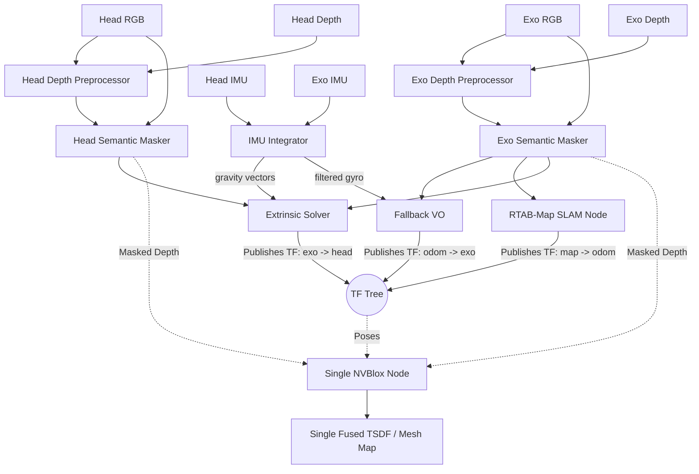

# Multi-Agent RGB-D SLAM and Volumetric Fusion Pipeline

This project implements a topic-driven multi-agent RGB-D pipeline for two synchronized camera streams: the head camera and the exo camera. The design assumes that RGB and depth images are already being published as ROS 2 topics by the upstream camera stack.

The package cleans the depth, removes dynamic objects, estimates the rigid transform between the two views, tracks the robot's pose in the world, and fuses both camera streams into a single, high-fidelity 3D map. IMU data (accelerometer + gyroscope) from both cameras is used to enforce gravity-aligned extrinsic calibration and to assist visual odometry.

## High-Level Goal

The goal is to produce a **single fused 3D map** in a shared coordinate system.

To achieve this, the pipeline separates the concerns of pose tracking and 3D reconstruction:
* **RTAB-Map** runs on the **Exo camera** stream. It uses `rgbd_odometry` (via the python `fallback_vo` node, now with gyro-assisted frame prediction) to track the robot's movement and the SLAM node to broadcast the `map -> odom -> exo_link` TF.
* **IMU Integrator** processes raw `/camera/*/imu` topics from both cameras, publishing gravity direction, filtered gyroscope readings, motion state, and gyro bias estimates.
* **The Extrinsic Solver** dynamically calculates and broadcasts the spatial link between the cameras (**`exo_link -> head_link`** TF). It uses IMU gravity vectors to reject physically impossible rotation estimates.
* **NVBlox** consumes the combined TF tree and the depth streams from both cameras to perform real-time volumetric TSDF fusion into a single global map.

## Data Flow Overview



## 1. Depth Pre-Processing

The first stage cleans the incoming depth stream before any downstream algorithm sees it. This node subscribes to the camera-specific aligned depth topic and republishes a filtered depth topic.

### Purpose
* Reduce sensor noise.
* Fill small holes in the depth image.
* Stabilize frame-to-frame depth variation.
* Improve the quality of inputs to tracking, calibration, and fusion.

### Current Behavior
Each depth preprocessor reads the input topic from YAML, sanitizes invalid values (NaN, infinity), applies spatial smoothing and temporal blending, and publishes the cleaned depth.

## 2. Semantic Masking

This stage removes dynamic objects from the RGB and depth images. People and moving machinery can corrupt geometric tracking and introduce "ghosting" in the final 3D map.

### Purpose
* Maintain strict static scene geometry for RTAB-Map and NVBlox.
* Prevent dynamic obstacles from becoming permanent fixtures in the 3D map.

### Current Behavior
The semantic masker relies on a detector-backed masking step (e.g., YOLOv8 via Ultralytics). It zeros out masked pixels in both the RGB and Depth images.

## 3. IMU Integration

The IMU integrator processes raw RealSense IMU data from both cameras and publishes cleaned, derived quantities.

### Purpose
* Provide gravity direction vectors for the extrinsic solver to constrain rotation estimates.
* Provide filtered gyroscope readings for gyro-assisted visual odometry.
* Detect motion state (stationary vs moving) for adaptive algorithm behavior.
* Estimate gyroscope bias during stationary periods.

### Current Behavior
A single `imu_integrator` node subscribes to `/camera/head/imu` and `/camera/exo/imu` (sensor_msgs/Imu). It maintains a sliding window of accelerometer and gyroscope samples for each camera. At a configurable rate (default 10 Hz), it:
* Estimates a low-pass filtered gravity vector (EMA over accelerometer readings).
* Detects motion based on gyroscope magnitude and accelerometer variance.
* Accumulates gyroscope samples during stationary periods for bias estimation.
* Publishes `/imu/*/gravity`, `/imu/*/gyro_filtered`, `/imu/*/motion_state`, and `/imu/*/gyro_bias`.

## 4. Pose Tracking (RTAB-Map + Gyro-Assisted VO)

The system uses a combination of Visual Odometry and SLAM on the **Exo camera** stream to localize the entire agent within the world.

### Purpose
* Provide robust Visual Odometry (VO) and loop closure.
* Calculate the camera's metric pose in the global frame.
* Publish the `map -> odom -> exo_link` TF transform.

### Current Behavior
* **`exo_rgbd_odometry`** (via `fallback_vo` node): Calculates motion between frames using the Exo camera's masked RGB-D stream. When IMU gyro data is available, it integrates angular velocity between frames to predict rotation, which narrows the feature matching search window and improves tracking robustness during fast motion or low-texture scenes. Publishes the `odom -> exo_link` transform.
* **`exo_rtabmap`**: Performs SLAM, loop closure detection, and publishes the `map -> odom` transform. Dense mapping is disabled as NVBlox handles 3D reconstruction.

## 5. 3D-to-3D Extrinsic Calibration (with IMU Gravity Constraint)

The extrinsic solver estimates the rigid transform between the exo camera and the head camera.

### Purpose
* Align the two camera frames in SE(3).
* Broadcast the resulting transform as a TF frame (**`exo_link -> head_link`**).
* Use IMU gravity vectors as a physical sanity check to reject rotation estimates that violate gravity alignment.

### Current Behavior
The solver extracts 2D feature correspondences between Exo and Head views using a configurable matcher (`orb` or `lightglue`), deprojects matched pixels into 3D points, and estimates the rigid transform via RANSAC. It broadcasts the transform from the Exo base link `exo_link` (parent) to the Head base link `head_link` (child).

If the IMU gravity constraint is enabled (default), the solver subscribes to `/imu/head/gravity` and `/imu/exo/gravity`. After a successful RANSAC estimate, it checks: `R_estimated * g_head ≈ g_exo`. If the angular error exceeds the configured threshold (default 15°), the solution is rejected with status `REJECTED_GRAVITY_MISMATCH`. Gravity vectors are transformed from their IMU frame to the camera link frame via TF when available.

## 6. Volumetric Fusion (NVBlox)

The final stage feeds the masked depth data into a **single** NVBlox node. NVBlox relies on the TF tree generated by RTAB-Map and the Extrinsic Solver to integrate depth observations into the correct global position.

### Purpose
* Aggregate depth observations from *both* cameras over time.
* Produce a single, real-time TSDF-based mesh and 2D navigation costmap.

### Current Behavior
The unified NVBlox node subscribes to the masked depth topics of both cameras.
1. When an Exo depth frame arrives, NVBlox looks up the `map -> odom -> exo_link -> exo_camera_link` TF and integrates the voxels.
2. When a Head depth frame arrives, NVBlox looks up the `map -> odom -> exo_link -> head_link -> head_camera_link` TF and integrates the voxels into the same map.

## 7. Evaluation

Post-hoc evaluation is available for both extrinsic calibration and IMU metrics.

### Extrinsic Metrics
The extrinsic solver logs per-frame data to `extrinsic_metrics.csv` (enabled via `metrics_enabled: true` in common.yaml). Columns include match counts, RANSAC inliers, RMSE, status code, and estimated transform. When ground truth TF frames are configured, translation and rotation errors are also logged.

`plot_metrics.py` reads the CSV and generates `extrinsic_metrics_plot.png`:
```bash
python3 plot_metrics.py                                # reads extrinsic_metrics.csv
python3 plot_metrics.py --extrinsic <path>              # force extrinsic mode
```

### IMU Metrics
When IMU gravity constraint is enabled, the CSV also includes `gravity_error_deg`, `is_stationary`, and `imu_constraint_applied` columns.

`evaluate_imu.py` reads `extrinsic_metrics.csv` and writes `imu_evaluation.csv` (per-frame data + summary row). `plot_metrics.py --imu` reads it and generates `imu_metrics_plot.png`:

```bash
run.sh --eval-imu                                       # chains evaluate_imu.py → plot_metrics.py --imu
# Or manually:
python3 -m exo_head_slam.evaluate_imu                   # reads → imu_evaluation.csv
python3 plot_metrics.py --imu                           # reads imu_evaluation.csv → imu_metrics_plot.png
```

## Configuration Layout

The pipeline is configured through three YAML files:
* `config/head.yaml`: Head camera topics and parameters (depth preprocessor, semantic masker, NVBlox, IMU processor topics).
* `config/exo.yaml`: Exo camera topics and parameters (depth preprocessor, semantic masker, NVBlox, RTAB-Map, fallback VO).
* `config/common.yaml`: Shared parameters (extrinsic solver matchers, TF frame names, IMU gravity constraint config, IMU integrator params).

## Launch Structure

The top-level entry point is `launch/main_pipeline_launch.py`. It starts:
* Two depth preprocessing nodes.
* Two semantic masking nodes.
* One IMU integrator node (before extrinsic solver).
* One extrinsic solver node (with IMU gravity constraint).
* Two RTAB-Map nodes for the Exo camera (Odometry + SLAM), optional.
* One NVBlox node (Global fusion).
* Two static TF publishers for camera link frames.

## Running

```bash
./run.sh                                                   # default bag, no eval
./run.sh <bag_path>                                        # custom bag
./run.sh --eval-imu                                        # default bag + IMU evaluation
./run.sh <bag_path> --eval-imu                             # custom bag + IMU evaluation
```

## Runtime Assumptions
* RGB and depth images are published as ROS 2 topics.
* Depth images are aligned to color.
* The two camera streams are roughly time-synchronized.
* Camera calibration data is available through `camera_info` topics.
* IMU data (sensor_msgs/Imu) on `/camera/head/imu` and `/camera/exo/imu` is optional — without it the pipeline runs in visual-only mode (gravity constraint and gyro assist are skipped).
