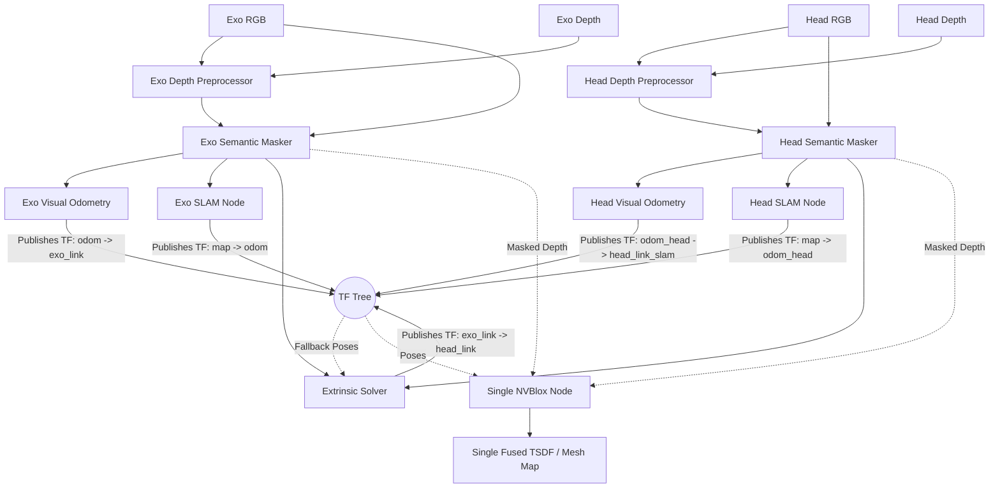

# Multi-Agent RGB-D SLAM and Volumetric Fusion Pipeline

This project implements a topic-driven multi-agent RGB-D pipeline for two synchronized camera streams: the head camera and the exo camera. The design assumes that RGB and depth images are already being published as ROS 2 topics by the upstream camera stack. 

The package cleans the depth, removes dynamic objects, estimates the rigid transform between the two views, tracks the robot's pose in the world, and fuses both camera streams into a single, high-fidelity 3D map.

## High-Level Goal

The goal is to produce a **single fused 3D map** in a shared coordinate system. 

To achieve this, the pipeline separates the concerns of pose tracking and 3D reconstruction:
* **RTAB-Map** runs on both the **Exo camera** and **Head camera** streams. It runs dual visual odometry and SLAM nodes to track each camera in a shared global `map` frame (publishing `map -> odom -> exo_link` and `map -> odom_head -> head_link_slam`).
* **The Extrinsic Solver** dynamically calculates and broadcasts the relative spatial link between the cameras (**`exo_link -> head_link`** TF). It uses direct 2D-to-3D feature matching as the primary tracker and automatically falls back to SLAM-pose-based calibration when direct matching fails.
* **NVBlox** consumes the combined TF tree and the depth streams from both cameras to perform real-time volumetric TSDF fusion into a single global map.

## Data Flow Overview

## 1. Depth Pre-Processing

The first stage cleans the incoming depth stream before any downstream algorithm sees it. This node subscribes to the camera-specific aligned depth topic and republishes a filtered depth topic.

### Purpose
* Reduce sensor noise.
* Fill small holes in the depth image.
* Stabilize frame-to-frame depth variation.
* Improve the quality of inputs to tracking, calibration, and fusion.

### Current Behavior
Each depth preprocessor reads the input topic from YAML, sanitizes invalid values (NaN, infinity), applies spatial smoothing and temporal blending, and publishes the cleaned depth.

## 2. Semantic Masking

This stage removes dynamic objects from the RGB and depth images. People and moving machinery can corrupt geometric tracking and introduce "ghosting" in the final 3D map.

### Purpose
* Maintain strict static scene geometry for RTAB-Map and NVBlox.
* Prevent dynamic obstacles from becoming permanent fixtures in the 3D map.

### Current Behavior
The semantic masker relies on a detector-backed masking step (e.g., YOLOv8 via Ultralytics). It zeros out masked pixels in both the RGB and Depth images.

## 3. Dual-SLAM Pose Tracking (RTAB-Map)

The system uses parallel tracking pipelines in the shared `map` frame to localize both the exoskeleton base and the head camera.

### Purpose
* Provide robust Visual Odometry (VO) and loop closure for both sensors.
* Maintain separate localization trees (`map -> odom -> exo_link` and `map -> odom_head -> head_link_slam`) to avoid circular TF dependencies.
* Provide continuous pose estimates for the SLAM-based extrinsic calibration fallback.

### Current Behavior
* **Exo Tracking:**
  * **`exo_rgbd_odometry`** (via `fallback_vo` node): Computes visual odometry for the Exo camera, publishing the `odom -> exo_link` TF.
  * **`exo_rtabmap`**: Runs SLAM on the Exo camera, publishing the `map -> odom` TF.
* **Head Tracking:**
  * **`head_rgbd_odometry`** (via `fallback_vo` node): Computes visual odometry for the Head camera, publishing the `odom_head -> head_link_slam` TF.
  * **`head_rtabmap`**: Runs SLAM on the Head camera, publishing the `map -> odom_head` TF.

## 4. 3D-to-3D Extrinsic Calibration & SLAM Fallback

The extrinsic solver estimates the rigid transform between the exo camera and the head camera.

### Purpose
* Align the two camera frames in SE(3).
* Broadcast the resulting transform as a TF frame (**`exo_link -> head_link`**).
* **Fallback Tracking:** Gracefully fall back to SLAM-pose-based calibration when 2D matching fails due to low FOV overlap or rapid movement.

### Current Behavior
1. **Direct 2D-3D Matching:** The solver extracts feature correspondences between Exo and Head views using a configurable matcher (`orb` or `lightglue`), deprojects matches to 3D, and estimates the transform via RANSAC/SVD.
2. **SLAM Pose Fallback:** If direct matching fails, the solver queries TF2 for the relative transform between `exo_link` and `head_link_slam` (which are both aligned to the shared `map` frame).
3. **EMA Filter:** The computed transform is smoothed using an Exponential Moving Average (EMA) filter and broadcasted as `exo_link -> head_link`.

## 5. Volumetric Fusion (NVBlox)

The final stage feeds the masked depth data into a **single** NVBlox node. NVBlox relies on the TF tree generated by RTAB-Map and the Extrinsic Solver to integrate depth observations into the correct global position.

### Purpose
* Aggregate depth observations from *both* cameras over time.
* Produce a single, real-time TSDF-based mesh and 2D navigation costmap.

### Current Behavior
The unified NVBlox node subscribes to the masked depth topics of both cameras. 
1. When an Exo depth frame arrives, NVBlox looks up the `map -> odom -> exo_link -> exo_camera_link` TF and integrates the voxels.
2. When a Head depth frame arrives, NVBlox looks up the `map -> odom -> exo_link -> head_link -> head_camera_link` TF and integrates the voxels into the same map.

## Configuration Layout

The pipeline is configured through three YAML files:
* `config/head.yaml`: Head camera topics and parameters.
* `config/exo.yaml`: Exo camera topics and parameters.
* `config/common.yaml`: Shared parameters (extrinsic solver matchers, TF frame names).

## Launch Structure

The top-level entry point is `launch/main_pipeline_launch.py`. It starts:
* Two depth preprocessing nodes.
* Two semantic masking nodes.
* One extrinsic solver node.
* **Four** RTAB-Map tracking nodes (2 for Exo: Odometry + SLAM, and 2 for Head: Odometry + SLAM).
* **One** NVBlox node (Global fusion).

## Runtime Assumptions
* RGB and depth images are published as ROS 2 topics.
* Depth images are aligned to color.
* The two camera streams are roughly time-synchronized.
* Camera calibration data is available through `camera_info` topics.

## 6. Evaluation Metrics

System performance is analyzed offline using the `plot_metrics.py` tool, which processes the output `extrinsic_metrics.csv` to track:
* **Match Statistics:** 2D matches, 3D deprojected matches, and RANSAC inliers.
* **Solver Quality:** RANSAC RMSE and inlier ratios.
* **Accuracy vs. Ground Truth:** Split translation and rotation errors for both Direct Match and SLAM Fallback modes.
* **System Robustness:** Fallback Reliance Rate (percentage of successful frames utilizing SLAM fallback).
* **Inter-Agent Map Consistency:** Mean and standard deviation (jitter) of the computed camera-to-camera distance over time to measure SLAM drift.
