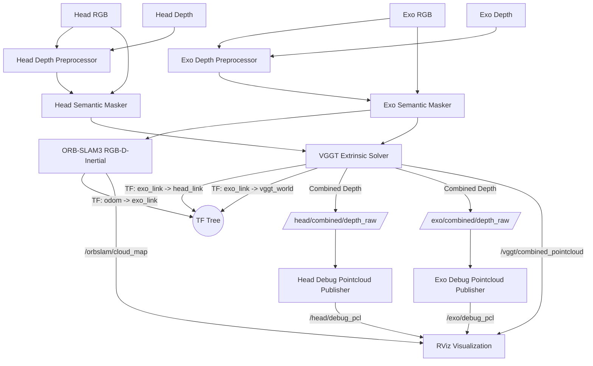

# Multi-Agent RGB-D SLAM Pipeline

This project implements a topic-driven multi-agent RGB-D pipeline for two synchronized camera streams: the head camera and the exo camera. The design assumes that RGB and depth images are already being published as ROS 2 topics by the upstream camera stack.

The package cleans the depth, removes dynamic objects, estimates the rigid transform between the two views, tracks the robot's pose in the world, and combines depth maps for real-time visualization of 3D point clouds.

## High-Level Goal

Produce a **single fused 3D map** in a shared coordinate system.

Pipeline separates pose-tracking from inter-camera calibration + dense-depth reconstruction:
* **ORB-SLAM3 RGB-D-inertial tracking** runs on the **Exo camera** stream. `odom -> exo_link` is published by ORB-SLAM3, and a lightweight dense accumulator publishes `/orbslam/cloud_map` in the odom frame.
* **The VGGT Extrinsic Solver** dynamically calculates and broadcasts the spatial link between the cameras (**`exo_link -> head_link`** TF) and the VGGT-1B world frame (**`exo_link -> vggt_world`** TF), and uses the VGGT depth-head confidence to gate the published `/vggt/combined_pointcloud`.
* **Dense Reconstruction**: the pipeline publishes combined depths (`/head/combined/depth_raw`, `/exo/combined/depth_raw`) and the conf-filtered `/vggt/combined_pointcloud` directly to RViz. Isaac ROS NVBlox volumetric fusion was removed in the latest refactor — point cloud visualization replaces it.

## Data Flow Overview

## 1. Depth Pre-Processing

First stage cleans the incoming depth stream before any downstream algorithm sees it. Subscribes to the camera-specific aligned depth topic and republishes a filtered depth topic.

### Purpose
* Reduce sensor noise.
* Fill small holes in the depth image.
* Stabilize frame-to-frame depth variation.
* Improve the quality of inputs to tracking, calibration, and fusion.

### Current Behavior
Each depth preprocessor reads the input topic from YAML, sanitizes invalid values (NaN, infinity), applies spatial bilateral smoothing and an EMA temporal blend, and publishes the cleaned depth.

## 2. Semantic Masking

Removes dynamic objects from the RGB and depth images. People and moving machinery can corrupt geometric tracking and introduce "ghosting" in the final 3D map.

### Purpose
* Maintain strict static scene geometry for the exo tracking stream.
* Prevent dynamic obstacles from becoming permanent fixtures in the 3D map.

### Current Behavior
Uses a detector-backed masking step (YOLOv8-seg via Ultralytics). Zeros out masked pixels in both the RGB and Depth images.

## 3. Pose Tracking & SLAM (ORB-SLAM3)

ORB-SLAM3 runs on the **Exo camera** stream with inertial input from `/camera/exo/imu`. The frame tree is fixed as `map -> odom` identity plus dynamic `odom -> exo_link` from ORB tracking. A dense accumulator projects `/exo/combined/depth_raw` into the odom frame and publishes `/orbslam/cloud_map`.

### Purpose
* Provide RGB-D-inertial tracking on the exo stream.
* Calculate the camera's metric pose in the global frame.
* Publish `odom -> exo_link` from ORB-SLAM3 while keeping `map -> odom` static identity.
* Accumulate a dense colored global cloud in the odom frame.

## 4. Deep-Learning-Based Extrinsic Solver (VGGT)

The extrinsic solver estimates the rigid transform between the cameras and combines depth maps using **VGGT-1B**.

### Purpose
* Align the two camera frames in SE(3).
* Broadcast the resulting transform as a TF frame (**`exo_link -> head_link`**).
* Scale predicted depths and point maps to align to the metric depth from the cameras.
* Broadcast the VGGT world frame transform (**`exo_link -> vggt_world`**).
* Publish a conf-filtered combined point cloud of both cameras in the shared `vggt_world` frame.

### Current Behavior
The solver loads the pretrained **VGGT-1B** model. When synchronized image/depth pairs arrive, it runs the forward pass through `aggregator`, `camera_head`, and `depth_head`. The depth head returns `(depth_map, depth_conf)` — the per-pixel confidence (range `(1, +inf)`, `1 + exp(x)`) is now used to gate outputs:
* **Depth combine gating** (`conf_gate_combine`): the `np.where` raw-vs-VGGT fill only writes VGGT pixels where `depth_conf` exceeds the per-frame percentile or absolute threshold.
* **Point cloud filtering** (`conf_filter_pointcloud`): `/vggt/combined_pointcloud` drops points whose `depth_conf` falls below the threshold.
* **Metrics**: the CSV log records `head_conf_p50/p95`, `exo_conf_p50/p95`, and `conf_thr` per frame (see `plot_metrics.py`).

Scale alignment uses a per-frame median ratio between raw metric depth and VGGT predicted depth; safety checks (distance bounds, Z-height, trans/rot jumps) and an EMA filter keep the broadcast TF stable.

## Configuration Layout

* `config/head.yaml`: Head camera depth_preprocessor + semantic_masker topics/params.
* `config/exo.yaml`: Exo camera depth_preprocessor and semantic_masker parameters.
* `config/orbslam3_exo.yaml`: ORB-SLAM3 settings template.
* `config/common.yaml`: `extrinsic_solver` params — frame ids, sliding window, TF EMA, VGGT confidence gating params, metrics.

## Launch Structure

`launch/main_pipeline_launch.py` is the top entry point. It starts:
* Two depth preprocessing nodes.
* Two semantic masking nodes.
* One extrinsic solver node (VGGT-based).
* Two pointcloud publisher nodes (debug pcl for Head + Exo, behind `publish_debug_pcl`).
* Static TF publishers for `exo_link -> exo_camera_link` and `head_link -> head_camera_link`.
* Includes `launch/orbslam3_exo_launch.py` — ORB-SLAM3 on the exo camera plus the dense global map accumulator.

## Runtime Assumptions
* RGB and depth images are published as ROS 2 topics.
* Depth images are aligned to color.
* The two camera streams are roughly time-synchronized.
* Camera calibration data is available through `camera_info` topics.
* A working `vggt/` vendored repo (or sibling dir) contains the VGGT model code; `extrinsic_solver_node.py` walks up to 6 parents searching for it.
