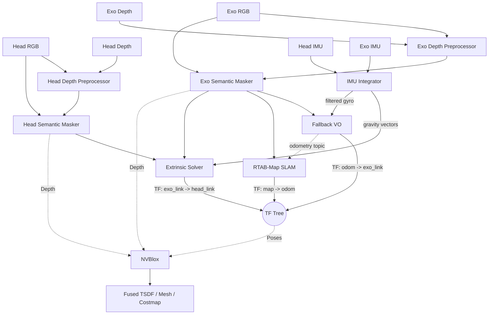

# Multi-Agent RGB-D SLAM and Volumetric Fusion Pipeline

This project implements a topic-driven multi-agent RGB-D pipeline for two synchronized camera streams: the head camera and the exo camera. The design assumes that RGB and depth images are already being published as ROS 2 topics by the upstream camera stack.

The package cleans the depth, removes dynamic objects, estimates the rigid transform between the two views, tracks the robot's pose in the world, and fuses both camera streams into a single, high-fidelity 3D map. IMU data (accelerometer + gyroscope) from both cameras is used to enforce gravity-aligned extrinsic calibration and to assist visual odometry.

## High-Level Goal

The goal is to produce a **single fused 3D map** in a shared coordinate system.

To achieve this, the pipeline separates the concerns of pose tracking and 3D reconstruction:
* **SLAM runs only on the exo camera.** RTAB-Map (with Python `fallback_vo` for odometry) tracks the exo camera and publishes `map -> odom -> exo_link` TF.
* **Head camera gets no SLAM.** Its pose is derived from the exo SLAM TF tree plus the dynamic extrinsic TF (`exo_link -> head_link`) computed by the extrinsic solver.
* **IMU Integrator** processes raw `/camera/*/imu` topics from both cameras, publishing gravity direction, filtered gyroscope readings, motion state, and gyro bias estimates.
* **The Extrinsic Solver** dynamically calculates and broadcasts the spatial link between the cameras (`exo_link -> head_link`). IMU gravity vectors reject physically impossible rotation estimates.
* **NVBlox** consumes the combined TF tree and the depth streams from both cameras to perform real-time volumetric TSDF fusion into a single global map.

## Data Flow Overview



Note: Only the exo camera has a SLAM pipeline. The head camera pose is computed as `map -> odom -> exo_link -> head_link`.

## 1. Depth Pre-Processing

The first stage cleans the incoming depth stream before any downstream algorithm sees it. This node subscribes to the camera-specific aligned depth topic and republishes a filtered depth topic.

### Purpose
* Reduce sensor noise.
* Fill small holes in the depth image.
* Stabilize frame-to-frame depth variation.

### Behavior
Each depth preprocessor reads the input topic from YAML, sanitizes invalid values (NaN, infinity), applies spatial smoothing and temporal blending, and publishes the cleaned depth.

## 2. Semantic Masking

Removes dynamic objects (people, vehicles) from RGB and depth images to prevent ghosting in the 3D map.

### Behavior
Uses YOLOv8-seg (via Ultralytics) to detect and mask dynamic classes. Masked pixels are zeroed in both RGB and depth outputs.

## 3. IMU Integration

Processes raw RealSense IMU data from both cameras and publishes cleaned, derived quantities.

### Behavior
A single `imu_integrator` node subscribes to `/camera/head/imu` and `/camera/exo/imu` (sensor_msgs/Imu). At a configurable rate (default 10 Hz) it:
* Estimates a low-pass filtered gravity vector per camera.
* Detects motion state (stationary vs moving).
* Accumulates gyro samples during stationary periods for bias estimation.
* Publishes `/imu/*/gravity`, `/imu/*/gyro_filtered`, `/imu/*/motion_state`, `/imu/*/gyro_bias`.

## 4. Pose Tracking (Exo Camera Only)

The exo camera drives the full SLAM pipeline. The head camera pose is derived indirectly.

### Exo Odometry (`fallback_vo`)
Python node that computes frame-to-frame motion using ORB or LightGlue feature matching + 3D deprojection + RANSAC. When IMU gyro data is available, integrates angular velocity between frames for a rotation prior, improving robustness during fast motion or low texture. Publishes `odom -> exo_link` TF.

### Exo SLAM (`rtabmap_slam`)
RTAB-Map node that consumes the odometry topic and performs SLAM with loop closure. Publishes `map -> odom` TF.

### Head Camera
No SLAM instance. Head pose is `map -> odom -> exo_link -> head_link`, where the last transform comes from the extrinsic solver.

## 5. Extrinsic Calibration (with IMU Gravity Constraint)

Estimates the rigid transform connecting head and exo camera frames.

### Behavior
* Subscribes to masked RGB-D streams from both cameras.
* Extracts 2D feature correspondences (ORB or LightGlue), deprojects to 3D, solves via RANSAC.
* Broadcasts `exo_link -> head_link` TF.
* When IMU gravity constraint is enabled: subscribes to `/imu/*/gravity`, transforms gravity vectors to link frames via TF, then checks `R_est * g_head ≈ g_exo`. If angular error exceeds threshold (default 15°), solution is rejected as `REJECTED_GRAVITY_MISMATCH`.

## 6. Volumetric Fusion (NVBlox)

Fuses both camera streams into a single TSDF volume on GPU.

### Behavior
NVBlox subscribes to masked depth + RGB + camera_info for both cameras. For each frame it looks up the full TF chain from `map` to that camera's link frame, then integrates into the TSDF. Publishes mesh (Marker), pointcloud (PointCloud2), and 2D costmap (OccupancyGrid).

## 7. Evaluation

### Extrinsic Metrics
`extrinsic_metrics.csv` is logged per-frame when `metrics_enabled: true`. Columns: match counts, RANSAC inliers, RMSE, status, estimated transform, gravity error, IMU constraint flag.

```bash
python3 plot_metrics.py                              # plot extrinsic metrics
python3 plot_metrics.py --extrinsic <path>            # force extrinsic mode
```

### IMU Metrics
`evaluate_imu.py` reads `extrinsic_metrics.csv`, writes `imu_evaluation.csv` (per-frame + summary). `plot_metrics.py --imu` generates `imu_metrics_plot.png`.

```bash
./run.sh --eval-imu                                   # full chain
python3 -m exo_head_slam.evaluate_imu                 # CSV only
python3 plot_metrics.py --imu                         # plot from CSV
```

## Configuration

* `config/head.yaml`: Head camera topics, depth/masker/NVBlox params, IMU topic references.
* `config/exo.yaml`: Exo camera topics, depth/masker/NVBlox/RTAB-Map/fallback VO params.
* `config/common.yaml`: Extrinsic solver, IMU gravity constraint, IMU integrator params.

## Launch Structure (`launch/main_pipeline_launch.py`)

```
2× depth_preprocessor (head + exo)
2× semantic_masker (head + exo)
1× imu_integrator
1× extrinsic_solver
2× static TF publishers (exo/exo_camera, head/head_camera)
2× rtabmap nodes (exo_rgbd_odometry + exo_rtabmap) — optional, skipped if rtabmap_slam not installed
1× nvblox_node
2× pointcloud_publisher (head + exo) — debug, conditional on publish_debug_pcl:=true
```

## Running

```bash
./run.sh                                                   # default bag
./run.sh <bag_path>                                        # custom bag
./run.sh --eval-imu                                        # with IMU evaluation
./run.sh <bag_path> --eval-imu                             # custom bag + eval
```

## Runtime Assumptions
* RGB and depth images published as ROS 2 topics, depth aligned to color.
* Camera calibration available via `camera_info` topics.
* Head and exo streams roughly time-synchronized.
* IMU topics (`/camera/*/imu`) optional — without them pipeline runs in visual-only mode.
* Only the exo camera runs SLAM; head pose derived via extrinsic TF.
