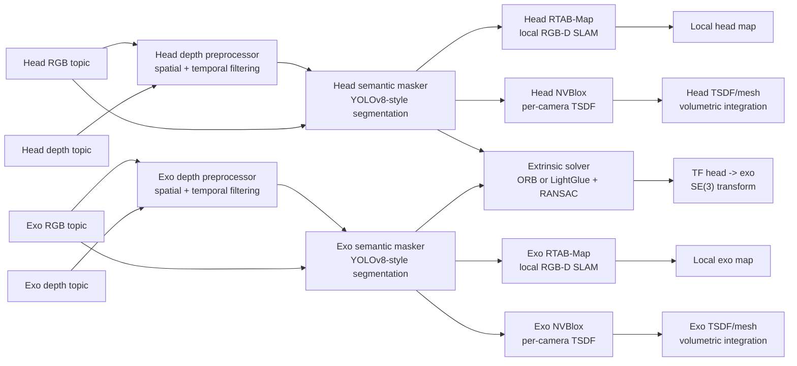

# Multi-Agent RGB-D SLAM Pipeline

This project implements a topic-driven multi-agent RGB-D pipeline for two synchronized camera streams: the head camera and the exo camera. The design assumes that RGB and depth images are already being published as ROS 2 topics by the upstream camera stack. The package consumes those topics, cleans the depth, removes dynamic objects, estimates the rigid transform between the two views, and forwards the aligned data to mapping and fusion backends.

## High-Level Goal

The goal is to produce two camera-local 3D reconstructions in a shared coordinate system, with RTAB-Map providing the local maps and NVBlox providing per-camera volumetric reconstructions. The extrinsic solver supplies the TF link between the cameras, but there is no dedicated node that merges RTAB-Map and NVBlox into a single fused map in the current implementation. The pipeline is structured around five stages:

1. Depth pre-processing
2. Semantic masking
3. Per-camera RGB-D SLAM
4. 3D-to-3D extrinsic calibration
5. Volumetric fusion

The current implementation is organized so that all runtime topics and parameters are stored in YAML files under `config/`, while the code only reads those parameters at launch time.

## Data Flow Overview

## 1. Depth Pre-Processing

The first stage cleans the incoming depth stream before any downstream algorithm sees it. This node subscribes to the camera-specific aligned depth topic and republishes a filtered depth topic.

### Purpose

- Reduce sensor noise
- Fill small holes in the depth image
- Stabilize frame-to-frame depth variation
- Improve the quality of inputs to masking, SLAM, and extrinsic estimation

### Current Behavior

Each depth preprocessor performs the following steps:

- Reads the configured input depth topic from YAML
- Converts the image to metric depth values when needed
- Sanitizes invalid values such as NaN and infinity
- Applies a spatial smoothing pass
- Applies a temporal blending pass using the previous filtered frame
- Publishes the cleaned depth on the configured output topic

### Files

- [exo_head_slam/depth_preprocessor_node.py](/home/baggio/master_thesis/exo_head_slam/exo_head_slam/depth_preprocessor_node.py)
- [config/head.yaml](/home/baggio/master_thesis/exo_head_slam/config/head.yaml)
- [config/exo.yaml](/home/baggio/master_thesis/exo_head_slam/config/exo.yaml)

## 2. Semantic Masking

The second stage removes dynamic objects from both RGB and depth images. This is important because people, moving limbs, or other moving objects can corrupt geometric tracking and map consistency.

### Purpose

- Keep static scene geometry for SLAM and fusion
- Remove dynamic pixels before they are consumed by downstream nodes
- Maintain consistency between masked RGB and masked depth

### Current Behavior

The semantic masker:

- Synchronizes RGB and depth frames
- Runs a detector-backed semantic masking step using Ultralytics when available
- Zeros out masked pixels in the RGB image
- Zeros out the corresponding depth pixels
- Publishes masked RGB and masked depth topics

### Notes

The current implementation loads a segmentation model from `masker.model_path` and uses `dynamic_classes` to decide which classes to erase. If Ultralytics is not installed, the node falls back to an empty mask and logs a warning.

If you want the real backend, install the optional Python dependency listed in `requirements.txt`.

### Files

- [exo_head_slam/semantic_masker_node.py](/home/baggio/master_thesis/exo_head_slam/exo_head_slam/semantic_masker_node.py)
- [config/head.yaml](/home/baggio/master_thesis/exo_head_slam/config/head.yaml)
- [config/exo.yaml](/home/baggio/master_thesis/exo_head_slam/config/exo.yaml)

## 3. Per-Camera RGB-D SLAM

Each camera runs its own RGB-D SLAM instance using RTAB-Map. The two streams are independent at this stage, which keeps the system modular and lets each agent maintain its own local map.

### Purpose

- Build a local map from each camera stream
- Estimate camera motion in metric scale
- Provide the local SLAM output for each viewpoint

### Current Behavior

RTAB-Map subscribes to:

- Masked RGB image topic
- Masked depth topic
- Camera info topic

The launch file constructs the correct remappings from YAML so the RTAB-Map nodes do not depend on hardcoded topic strings.

### Files

- [launch/rtabmap_agents_launch.py](/home/baggio/master_thesis/exo_head_slam/launch/rtabmap_agents_launch.py)
- [config/head.yaml](/home/baggio/master_thesis/exo_head_slam/config/head.yaml)
- [config/exo.yaml](/home/baggio/master_thesis/exo_head_slam/config/exo.yaml)

## 4. 3D-to-3D Extrinsic Calibration

The extrinsic solver estimates the rigid transform between the head camera and the exo camera.

### Purpose

- Align the two camera frames in SE(3)
- Broadcast the transform in TF for downstream consumers
- Provide the spatial link between both local maps

### Current Behavior

The solver:

- Synchronizes masked RGB and depth from both cameras
- Extracts 2D feature correspondences using a configurable matcher (`orb` by default, `lightglue` as an optional upgrade)
- Deprojects matched pixels into 3D points using camera intrinsics and depth
- Rejects invalid correspondences
- Estimates the rigid transform with RANSAC around an SVD-based transform solver
- Broadcasts the resulting transform as a TF frame from head to exo

If `lightglue` is selected, the node tries to use `LightGlue + SuperPoint` and falls back to ORB when the optional Python dependencies are not installed.

### Files

- [exo_head_slam/extrinsic_solver_node.py](/home/baggio/master_thesis/exo_head_slam/exo_head_slam/extrinsic_solver_node.py)
- [exo_head_slam/utils/math_utils.py](/home/baggio/master_thesis/exo_head_slam/exo_head_slam/utils/math_utils.py)
- [exo_head_slam/utils/vision_utils.py](/home/baggio/master_thesis/exo_head_slam/exo_head_slam/utils/vision_utils.py)
- [config/common.yaml](/home/baggio/master_thesis/exo_head_slam/config/common.yaml)

## 5. Volumetric Fusion

The final stage feeds the masked RGB-D data into NVBlox for volumetric fusion, but in the current implementation this remains per-camera rather than a single merged map.

### Purpose

- Aggregate depth observations over time
- Smooth random depth noise through voxel fusion
- Produce a per-camera TSDF-based representation and mesh-ready map

### Current Behavior

Each camera runs its own NVBlox node, consuming:

- Masked RGB
- Masked depth
- Camera info

This stage is designed to keep the per-camera reconstructions metrically consistent in the shared TF frame.

### Files

- [launch/nvblox_fusion_launch.py](/home/baggio/master_thesis/exo_head_slam/launch/nvblox_fusion_launch.py)
- [config/head.yaml](/home/baggio/master_thesis/exo_head_slam/config/head.yaml)
- [config/exo.yaml](/home/baggio/master_thesis/exo_head_slam/config/exo.yaml)

## Configuration Layout

The pipeline is configured through three YAML files:

- [config/head.yaml](/home/baggio/master_thesis/exo_head_slam/config/head.yaml) for the head camera path
- [config/exo.yaml](/home/baggio/master_thesis/exo_head_slam/config/exo.yaml) for the exo camera path
- [config/common.yaml](/home/baggio/master_thesis/exo_head_slam/config/common.yaml) for shared parameters such as the extrinsic solver

This split keeps camera-specific topics and parameters isolated while preserving a single shared document for the transform estimation logic.

The shared solver config also exposes `matcher_type`, so you can switch between `orb` and `lightglue` without touching code.

## Launch Structure

The top-level entry point is [launch/main_pipeline_launch.py](/home/baggio/master_thesis/exo_head_slam/launch/main_pipeline_launch.py).

It starts:

- Two depth preprocessing nodes
- Two semantic masking nodes
- One extrinsic solver node
- The RTAB-Map launch group
- The NVBlox launch group

The launch graph is intentionally symmetric across head and exo so both streams follow the same processing path. RTAB-Map and NVBlox are launched side by side and consume the same masked inputs; the only coupling between the two camera branches is the extrinsic TF.

## Topic Contract

The pipeline uses these topic groups:

- Raw camera input topics for RGB and depth
- Filtered depth topics from the preprocessor
- Masked RGB and depth topics from the semantic masker
- Camera info topics for intrinsics
- TF output from the extrinsic solver

All of these topic names are defined in YAML, which keeps the runtime wiring centralized and easy to change.

## Runtime Assumptions

- RGB and depth images are already published as ROS 2 topics by an upstream camera stack
- The depth images are aligned to color before they enter this package
- The two camera streams are roughly time-synchronized
- Camera calibration data is available through camera info topics

## Implementation Notes

- The current detector in the semantic masker is still a stub and is intended to be replaced with a real segmentation backend
- The extrinsic solver currently uses ORB features and RANSAC-based rigid alignment
- RTAB-Map and NVBlox are integrated through their standard ROS 2 interfaces
- The project is organized so that future changes can be made by editing YAML rather than hardcoding new topics into the Python nodes

## Package Entry Points

The executable nodes are exposed through `setup.py` and include:

- `depth_preprocessor`
- `semantic_masker`
- `extrinsic_solver`

These entry points are launched by the ROS 2 launch files rather than by direct script execution.