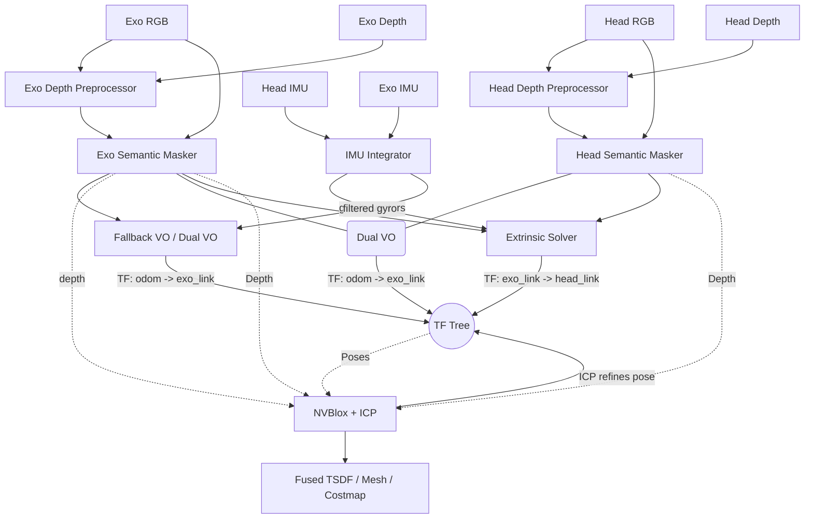

# Multi-Agent RGB-D SLAM and Volumetric Fusion Pipeline

This project implements a topic-driven multi-agent RGB-D pipeline for two synchronized camera streams: head camera and exo camera. RGB and depth images are already published as ROS 2 topics by the upstream camera stack.

Depth is cleaned, dynamic objects removed, extrinsic transform between cameras estimated, robot pose tracked, and both streams fused into a single 3D map. IMU data (accelerometer + gyroscope) from both cameras enforces gravity-aligned extrinsic calibration and assists visual odometry.

## High-Level Goal

**Single fused 3D map** in a shared coordinate system. The pipeline separates pose tracking from 3D reconstruction.

### Pose Tracking — two modes (configurable in `common.yaml`)

The `slam` section in `common.yaml` has a `mode` parameter:

| Mode | What runs | TF published | Use case |
|---|---|---|---|
| `dual_vo` | `dual_vo` node — dual-camera visual odometry with sliding-window pose graph | `map→odom` (identity), `odom→exo_link` | Best standalone VO, both cameras contribute |
| `nvblox_tracking` (default) | `fallback_vo` for odometry + NVBlox built-in ICP frame-to-model tracking | `odom→exo_link` only (map→odom is static identity) | Drift-resistant via TSDF ICP |

In both modes, head camera pose is derived as `map→odom→exo_link→head_link`, where the last transform comes from the extrinsic solver.

### 3D Reconstruction

NVBlox consumes depth + RGB + TF tree from both cameras and performs GPU-accelerated TSDF fusion into a single map (mesh + pointcloud + costmap).

### IMU Integrator

Processes raw `/camera/*/imu` topics from both cameras, publishing gravity direction, filtered gyroscope, motion state, and gyro bias estimates.

### Extrinsic Solver

Dynamically computes `exo_link→head_link` using feature matching + RANSAC. IMU gravity vectors reject physically impossible rotation estimates. Gyro propagation maintains the transform during visual tracking failures.

## Data Flow Overview



## 1. Depth Pre-Processing

Cleans incoming depth streams before downstream use. Subscribes to camera-specific aligned depth topic, republishes filtered depth.

### Behavior
Reads input topic from YAML, sanitizes NaN/infinity, applies spatial smoothing (bilateral filter) and temporal blending (exponential moving average).

## 2. Semantic Masking

Removes dynamic objects (people, vehicles) from RGB and depth to prevent ghosting in the 3D map.

### Behavior
Uses YOLOv8-seg (Ultralytics) to detect and mask dynamic classes. Masked pixels zeroed in both RGB and depth outputs. Falls back to empty mask if `ultralytics` not installed.

## 3. IMU Integration

Processes raw RealSense IMU data from both cameras.

### Behavior
Single `imu_integrator` node subscribes to `/camera/head/imu` and `/camera/exo/imu`. At configurable rate (default 10 Hz): estimates low-pass filtered gravity vector per camera, detects motion state (stationary vs moving), accumulates gyro samples during stationary periods for bias estimation. Publishes `/imu/*/gravity`, `/imu/*/gyro_filtered`, `/imu/*/motion_state`, `/imu/*/gyro_bias`.

## 4. Pose Tracking — Two Modes

The launch system (`launch/slam_launch.py`) selects mode from `common.yaml` → `slam.mode`.

### Mode: `dual_vo` (dual-camera visual odometry)

`dual_vo_node.py` subscribes to both head and exo masked RGB-D streams. Per-frame: matches features temporally (each camera independently) and cross-camera (head↔exo using known extrinsic). A sliding-window pose graph (configurable window, default 20 keyframes) fuses temporal and cross-camera constraints with graph optimization. IMU gyro provides rotation prior when visual tracking fails. Publishes `odom→exo_link` TF and `/slam/odom` topic.

### Mode: `nvblox_tracking` (default)

`fallback_vo_node.py` tracks exo camera only via ORB/LightGlue feature matching + 3D deprojection + RANSAC. IMU gyro integrated between frames for rotation prior during fast motion. Publishes `odom→exo_link` TF. NVBlox additionally runs ICP frame-to-model tracking against the TSDF (see §6), which corrects drift.

### Head Camera

No independent SLAM. Head pose is `map→odom→exo_link→head_link` where `exo_link→head_link` comes from extrinsic solver.

### Legacy: RTAB-Map

`launch/rtabmap_agents_launch.py` exists but is NOT included by `main_pipeline_launch.py`.

## 5. Extrinsic Calibration (with IMU Gravity Constraint)

Estimates rigid transform `exo_link→head_link`.

### Behavior
- Subscribes to masked RGB-D from both cameras + IMU gravity/gyro/motion topics.
- 2D feature matching (ORB or LightGlue) → deproject to 3D → RANSAC.
- Transforms 3D points from optical frames to link frames via TF.
- Applies sanity checks: distance bounds (0.2–2.2 m), height bounds (0.1–1.5 m), translation/rotation jumps (tighter when stationary via IMU motion state).
- **IMU gravity constraint**: checks `R_est * g_head ≈ g_exo`; rejects if angular error > threshold (default 15°).
- **Gyro propagation**: if visual solve fails, integrates head↔exo relative angular velocity to maintain transform (up to `max_duration` seconds).
- Exponentially filters successive solutions (`tf_filter_alpha`).
- Broadcasts `exo_link→head_link` TF at 10 Hz to prevent TF buffer expiry.

## 6. Volumetric Fusion (NVBlox + Optional ICP)

Fuses both camera streams into single TSDF volume on GPU.

### Behavior
- Synchronous subscriber receives head + exo depth/RGB/camera_info (6 topics, approximated time sync, slop 0.1 s).
- For each frame: looks up full TF chain from `global_frame` (default `map`) to camera frame, integrates into TSDF via `nvblox_torch`.
- **ICP mode** (`icp_enabled: true`, default): exo pose tracked frame-to-model against the TSDF. Renders synthetic depth from current TSDF, runs point-to-plane ICP between real and synthetic depth. Head pose derived from exo ICP pose × `exo_color_optical_frame→head_color_optical_frame` static TF. ICP runs in a background thread.
- Publishes mesh (Marker), pointcloud (PointCloud2), and 2D costmap (OccupancyGrid) every `mesh_update_period` frames.

## 7. Evaluation

### Extrinsic Metrics
`extrinsic_metrics.csv` logged per-frame when `metrics_enabled: true`. Columns: match counts, RANSAC inliers, RMSE, status, estimated transform, gravity error, IMU constraint flag.

```bash
python3 plot_metrics.py                              # plot extrinsic metrics
python3 plot_metrics.py --extrinsic <path>            # force extrinsic mode
```

## Configuration

- `config/head.yaml`: Head camera topics, depth/masker params.
- `config/exo.yaml`: Exo camera topics, depth/masker params.
- `config/common.yaml`: `extrinsic_solver` params (matcher, IMU constraints), `imu_integrator` params, `slam` params (mode, matcher, pose graph, ICP).

## Launch Structure (`launch/main_pipeline_launch.py`)

```
2× depth_preprocessor (head + exo)
2× semantic_masker (head + exo)
1× imu_integrator
1× extrinsic_solver
4× static TF publishers (exo/exo_color/exo_optical, head/head_color/head_optical)
2× pointcloud_publisher (head + exo) — debug, conditional on publish_debug_pcl:=true
→ includes launch/slam_launch.py (dual_vo or fallback_vo per mode)
→ includes launch/nvblox_fusion_launch.py (nvblox_node with optional ICP)
```

## Running

```bash
./run.sh                                                   # default bag
./run.sh <bag_path>                                        # custom bag
```

## Runtime Assumptions

- RGB and depth images published as ROS 2 topics, depth aligned to color.
- Camera calibration available via `camera_info` topics.
- Head and exo streams roughly time-synchronized.
- IMU topics (`/camera/*/imu`) optional — without them pipeline runs in visual-only mode.
- Only exo camera has dedicated SLAM/odometry; head pose derived via extrinsic TF.
