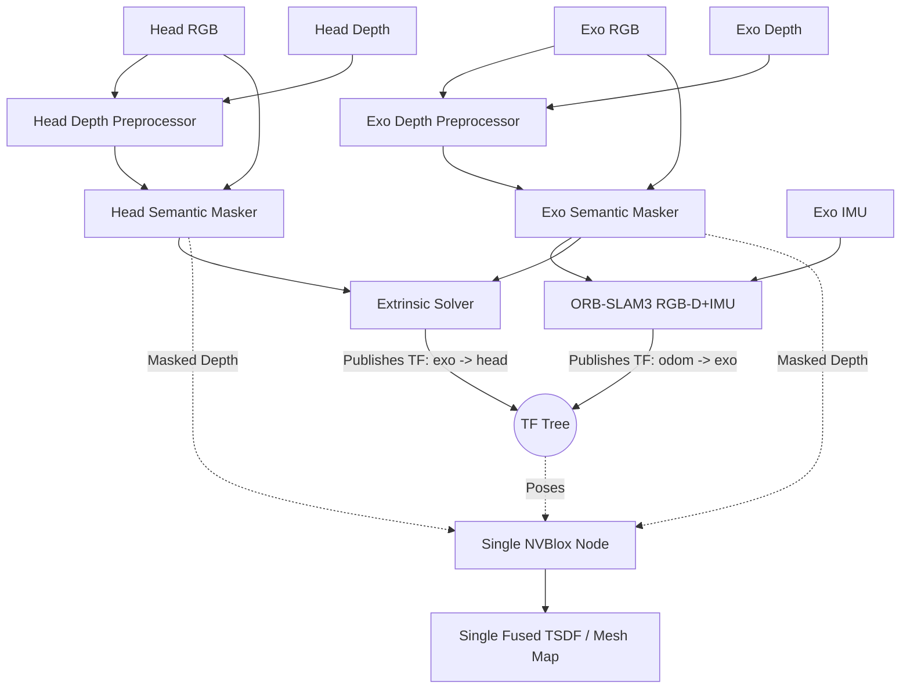

# Multi-Agent RGB-D SLAM and Volumetric Fusion Pipeline

This project implements a topic-driven multi-agent RGB-D pipeline for two synchronized camera streams: the head camera and the exo camera. The design assumes that RGB and depth images are already being published as ROS 2 topics by the upstream camera stack. 

The package cleans the depth, removes dynamic objects, estimates the rigid transform between the two views, tracks the robot's pose in the world, and fuses both camera streams into a single, high-fidelity 3D map.

## High-Level Goal

The goal is to produce a **single fused 3D map** in a shared coordinate system. 

To achieve this, the pipeline separates the concerns of pose tracking and 3D reconstruction:
* **ORB-SLAM3** runs on the **Exo camera** RGB-D stream and optionally consumes IMU data. It broadcasts the `odom -> exo_link` TF.
* **The Extrinsic Solver** dynamically calculates and broadcasts the spatial link between the cameras (**`exo_link -> head_link`** TF).
* **NVBlox** consumes the combined TF tree and the depth streams from both cameras to perform real-time volumetric TSDF fusion into a single global map.

## Data Flow Overview

## 1. Depth Pre-Processing

The first stage cleans the incoming depth stream before any downstream algorithm sees it. This node subscribes to the camera-specific aligned depth topic and republishes a filtered depth topic.

### Purpose
* Reduce sensor noise.
* Fill small holes in the depth image.
* Stabilize frame-to-frame depth variation.
* Improve the quality of inputs to tracking, calibration, and fusion.

### Current Behavior
Each depth preprocessor reads the input topic from YAML, sanitizes invalid values (NaN, infinity), applies spatial smoothing and temporal blending, and publishes the cleaned depth.

## 2. Semantic Masking

This stage removes dynamic objects from the RGB and depth images. People and moving machinery can corrupt geometric tracking and introduce "ghosting" in the final 3D map.

### Purpose
* Maintain strict static scene geometry for ORB-SLAM3 and NVBlox.
* Prevent dynamic obstacles from becoming permanent fixtures in the 3D map.

### Current Behavior
The semantic masker relies on a detector-backed masking step (e.g., YOLOv8 via Ultralytics). It zeros out masked pixels in both the RGB and Depth images.

## 3. Pose Tracking (ORB-SLAM3)

The system uses ORB-SLAM3 on the **Exo camera** stream to localize the entire agent within the world. `rgbd_imu` is the target runtime; `rgbd` exists for bags without IMU.

### Purpose
* Provide RGB-D visual-inertial tracking.
* Calculate the camera's metric pose in the global frame.
* Publish the `odom -> exo_link` TF transform.

### Current Behavior
* **`orbslam3_exo`**: Calculates motion from masked Exo RGB-D and IMU. Publishes `/exo/odom` and `odom -> exo_link`.
* **`fallback_vo` / RTAB-Map**: Legacy/debug path only.

## 4. 3D-to-3D Extrinsic Calibration

The extrinsic solver estimates the rigid transform between the exo camera and the head camera.

### Purpose
* Align the two camera frames in SE(3).
* Broadcast the resulting transform as a TF frame (**`exo_link -> head_link`**).

### Current Behavior
The solver extracts 2D feature correspondences between Exo and Head views using a configurable matcher (`orb` or `lightglue`), deprojects matched pixels into 3D points, and estimates the rigid transform. It broadcasts the transform from the Exo base link `exo_link` (parent) to the Head base link `head_link` (child).

## 5. Volumetric Fusion (NVBlox)

The final stage feeds the masked depth data into a **single** NVBlox node. NVBlox relies on the TF tree generated by ORB-SLAM3 and the Extrinsic Solver to integrate depth observations into the correct global position.

### Purpose
* Aggregate depth observations from *both* cameras over time.
* Produce a single, real-time TSDF-based mesh and 2D navigation costmap.

### Current Behavior
The unified NVBlox node subscribes to the masked depth topics of both cameras. 
1. When an Exo depth frame arrives, NVBlox looks up the `odom -> exo_link -> exo_camera_link` TF and integrates the voxels.
2. When a Head depth frame arrives, NVBlox looks up the `odom -> exo_link -> head_link -> head_camera_link` TF and integrates the voxels into the same map.

## Configuration Layout

The pipeline is configured through YAML files:
* `config/head.yaml`: Head camera topics and parameters.
* `config/exo.yaml`: Exo camera topics and parameters.
* `config/common.yaml`: Shared parameters (extrinsic solver matchers, TF frame names).
* `config/orbslam3_exo.yaml`: ORB-SLAM3 topics, frames, and IMU parameters.

## Launch Structure

The top-level entry point is `launch/main_pipeline_launch.py`. It starts:
* Two depth preprocessing nodes.
* Two semantic masking nodes.
* One extrinsic solver node.
* One ORB-SLAM3 wrapper for the Exo camera.
* **One** NVBlox node (Global fusion).

## Runtime Assumptions
* RGB and depth images are published as ROS 2 topics.
* Depth images are aligned to color.
* The two camera streams are roughly time-synchronized.
* Camera calibration data is available through `camera_info` topics.
* `rgbd_imu` mode requires `/camera/exo/imu` and calibrated camera-IMU extrinsics.
