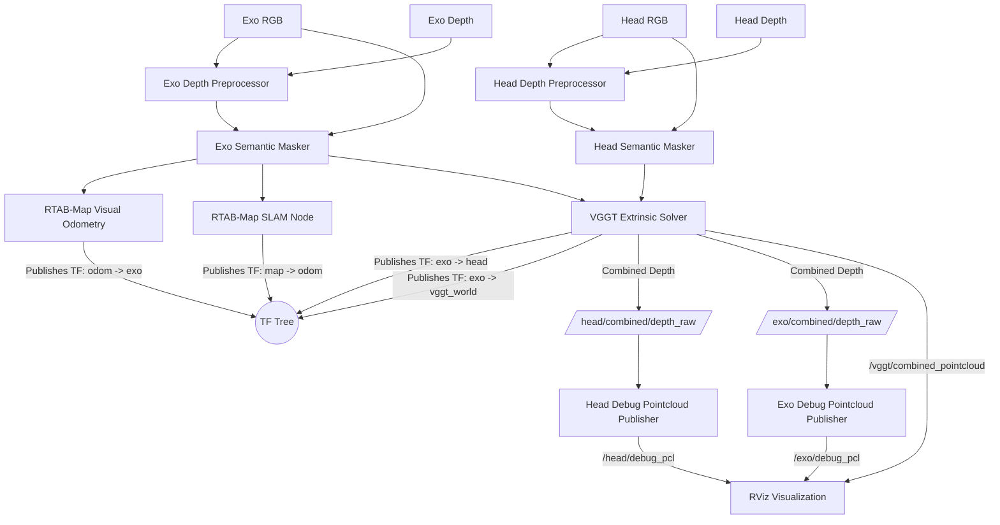

# Multi-Agent RGB-D SLAM and Volumetric Fusion Pipeline

This project implements a topic-driven multi-agent RGB-D pipeline for two synchronized camera streams: the head camera and the exo camera. The design assumes that RGB and depth images are already being published as ROS 2 topics by the upstream camera stack. 

The package cleans the depth, removes dynamic objects, estimates the rigid transform between the two views, tracks the robot's pose in the world, and combines depth maps for real-time visualization of 3D point clouds.

## High-Level Goal

The goal is to produce a **single fused 3D map** in a shared coordinate system. 

To achieve this, the pipeline separates the concerns of pose tracking and 3D reconstruction:
* **RTAB-Map** runs on the **Exo camera** stream. It uses `rgbd_odometry` (via the python `fallback_vo` node) to track the robot's movement and the SLAM node to broadcast the `map -> odom -> exo_link` TF.
* **The Extrinsic Solver** dynamically calculates and broadcasts the spatial link between the cameras (**`exo_link -> head_link`** TF) and relative to the VGGT world frame (**`exo_link -> vggt_world`** TF).
* **Volumetric Reconstruction**: The pipeline processes combined depths and unprojected point maps using deep learning to publish dense 3D point clouds directly to RViz. (Note: Isaac ROS NVBlox volumetric fusion is currently disabled to focus on direct point cloud display).

## Data Flow Overview

## 1. Depth Pre-Processing

The first stage cleans the incoming depth stream before any downstream algorithm sees it. This node subscribes to the camera-specific aligned depth topic and republishes a filtered depth topic.

### Purpose
* Reduce sensor noise.
* Fill small holes in the depth image.
* Stabilize frame-to-frame depth variation.
* Improve the quality of inputs to tracking, calibration, and fusion.

### Current Behavior
Each depth preprocessor reads the input topic from YAML, sanitizes invalid values (NaN, infinity), applies spatial smoothing and temporal blending, and publishes the cleaned depth.

## 2. Semantic Masking

This stage removes dynamic objects from the RGB and depth images. People and moving machinery can corrupt geometric tracking and introduce "ghosting" in the final 3D map.

### Purpose
* Maintain strict static scene geometry for RTAB-Map.
* Prevent dynamic obstacles from becoming permanent fixtures in the 3D map.

### Current Behavior
The semantic masker relies on a detector-backed masking step (e.g., YOLOv8 via Ultralytics). It zeros out masked pixels in both the RGB and Depth images.

## 3. Pose Tracking (RTAB-Map)

The system uses a combination of Visual Odometry and SLAM on the **Exo camera** stream to localize the entire agent within the world.

### Purpose
* Provide robust Visual Odometry (VO) and loop closure.
* Calculate the camera's metric pose in the global frame.
* Publish the `map -> odom -> exo_link` TF transform.

### Current Behavior
* **`exo_rgbd_odometry`** (via `fallback_vo` node): Calculates motion between frames using the Exo camera's masked RGB-D stream. Publishes the `odom -> exo_link` transform.
* **`exo_rtabmap`**: Performs SLAM, loop closure detection, and publishes the `map -> odom` transform. Dense mapping is disabled as visualization is handled by point cloud publishers.

## 4. Deep-Learning-Based Extrinsic Solver (VGGT)

The extrinsic solver estimates the rigid transform between the cameras and combines depth maps.

### Purpose
* Align the two camera frames in SE(3).
* Broadcast the resulting transform as a TF frame (**`exo_link -> head_link`**).
* Scale predicted depths and point maps to align to the metric depth from the cameras.
* Broadcast the VGGT world frame transform (**`exo_link -> vggt_world`**).
* Publish a combined point cloud map of both cameras in the shared VGGT world frame.

### Current Behavior
The solver loads the pretrained **VGGT-1B** model. When synchronized image/depth pairs arrive, it runs the forward pass to predict extrinsics, intrinsics, and depth maps. It calculates a scale alignment factor relative to the metric depth from the cameras, and scales the translation and depths. It publishes combined depth maps (replacing missing raw depth with scaled VGGT depth) to `/head/combined/depth_raw` and `/exo/combined/depth_raw`. It also publishes `/vggt/combined_pointcloud` in the `vggt_world` frame.

## Configuration Layout

The pipeline is configured through three YAML files:
* `config/head.yaml`: Head camera topics and parameters.
* `config/exo.yaml`: Exo camera topics and parameters.
* `config/common.yaml`: Shared parameters (extrinsic solver settings, TF frame names).

## Launch Structure

The top-level entry point is `launch/main_pipeline_launch.py`. It starts:
* Two depth preprocessing nodes.
* Two semantic masking nodes.
* One extrinsic solver node (VGGT-based).
* Two RTAB-Map nodes for the Exo camera (Odometry + SLAM).
* Two pointcloud publisher nodes (for Head and Exo debug point clouds).

## Runtime Assumptions
* RGB and depth images are published as ROS 2 topics.
* Depth images are aligned to color.
* The two camera streams are roughly time-synchronized.
* Camera calibration data is available through `camera_info` topics.
